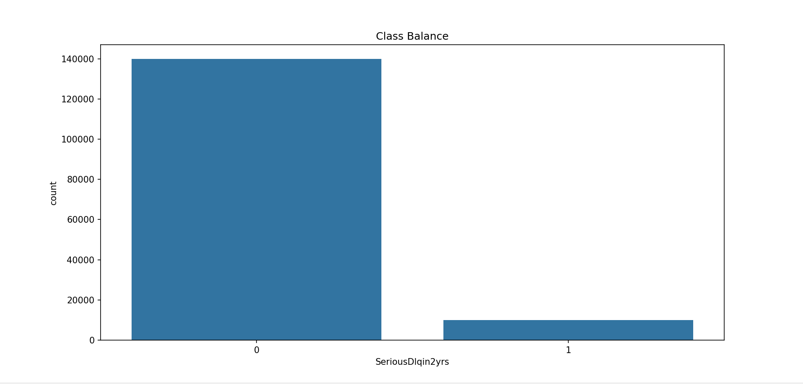
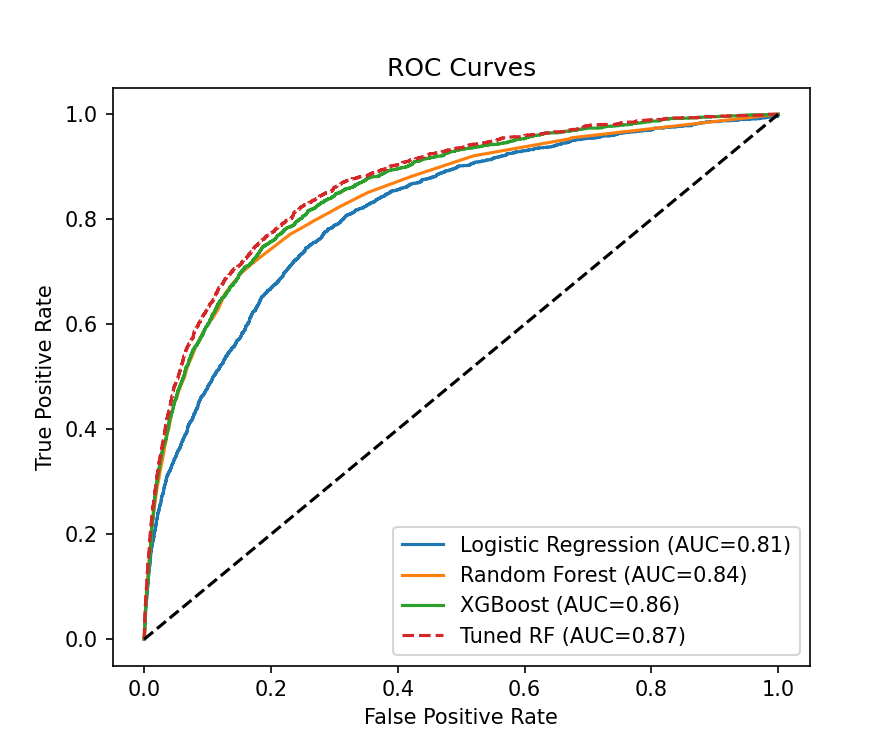

Bad Loan Prediction Project
==========================

Project Overview
---------------
This project aims to reduce bank losses caused by bad loans by building a machine learning model to help loan officers better identify risky applicants. The workflow follows a complete data science process, from goal definition to model evaluation and presentation.

Step-by-Step Process
--------------------

**Step 1**: Define the Goal
- Why is the project being started?
  - To reduce the rate of loan charge-offs by at least 10% using a predictive model.
- What is missing currently?
  - Existing methods are not accurate enough in identifying bad loan applicants.
- What is required?
  - A data-driven tool to assist loan officers in decision-making.
- Resources needed:
  - Historical loan data, domain expertise, and computational resources for model training.
- Deployment considerations:
  - The model should be easy to use, interpretable, and integrate with existing workflows.

**Step 2**: Collect and Manage Data
- Data used: Kaggle's Give Me Some Credit dataset (cs-training.csv).
- Attributes include: Loan status, duration, credit history, employment status, address duration, number of dependents, and active loans.
- Data exploration:
  - Visualizations and summary statistics to understand data quality and distribution.
  - Cleaning missing values and handling outliers.
- Potential issues:
  - Imbalanced classes, missing or noisy data, and the need for feature engineering.

**Step 3**: Build a Model
- Techniques used:
  - Classification models: Logistic Regression, Random Forest, XGBoost.
  - Feature engineering: Creating new features, scaling, and handling outliers.

**Step 4**: Model Evaluation
- Metrics: Accuracy, precision, recall, F1-score, ROC AUC, confusion matrix.
- Validation:
  - Cross-validation and hyperparameter tuning (GridSearchCV).
  - Comparison with baseline methods.

**Step 5**: Present Results and Document
- Visualizations:
  - Class balance, correlation heatmap, ROC curves, feature importance, confusion matrix.
- Documentation:
  - This README and in-code comments explain the workflow and findings.
- Insights:
  - Key features influencing default risk are highlighted.
  - Model performance is summarized for stakeholders.

**Step 6**: Deploy Model
- Deployment readiness:
  - The code is structured for easy integration into a larger system.
  - Next steps could include building an API or web app for real-time predictions.
- Human-in-the-loop:
  - The model is designed to assist, not replace, loan officers. Their expertise remains valuable.

**--------------------------------------------------**

**How to Run This Project**
1. Clone this repository and navigate to the project folder.
2. Download the dataset **cs-training.csv** from Kaggle and place it in the project directory.
3. Install dependencies:  **pip install pandas numpy scikit-learn matplotlib seaborn xgboost**
4. Run the script: **python Bad_loan.py**

**------------------------------------------------------**

**Results & Conclusions**
- The Random Forest model (after tuning) achieved the best performance in predicting loan defaults.
- Feature importance analysis revealed which variables are most predictive of default risk.
- Visualizations and metrics provide clear evidence of model efficacy.
- The workflow demonstrates the importance of data cleaning, feature engineering, and robust evaluation.

**Business Value**:
This model can help banks reduce losses by flagging high-risk applicants, leading to better decision-making and potentially lowering the rate of loan charge-offs.
